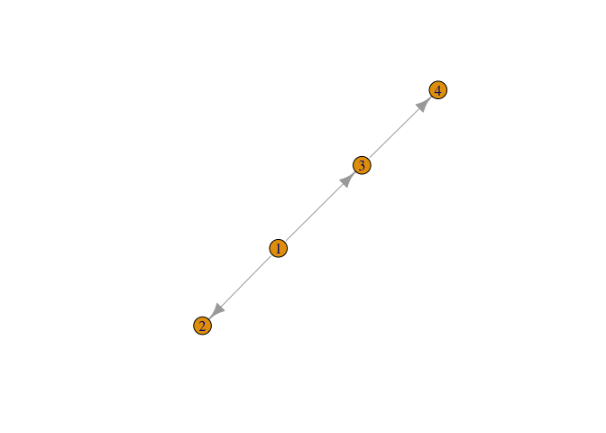

<!-- README.md is generated from README.Rmd. Please edit that file -->

# familytreemakeR

<!-- badges: start -->

[](https://lifecycle.r-lib.org/articles/stages.html#experimental)
[](https://CRAN.R-project.org/package=familytreemakeR)
<!-- badges: end -->

The goal of familytreemakeR is to make it easy for a useR to listen to
someome monologue about the structure of a family and, in real-time,
write a pipe-based script that, when run, generates an `igraph`
representing the family.

## Installation

You can install the development version of familytreemakeR from
[GitHub](https://github.com/) with:

``` r
# install.packages("devtools")
devtools::install_github("rcorty/familytreemakeR")
```

## Example

This is a basic example which shows you how to solve a common problem:

``` r
library(familytreemakeR)

there_was(first_name = 'Anakin', last_name = 'Skywalker') %>% 
    who_had_a(what = 'child', first_name = 'Luke', last_name = 'Skywalker') %>% 
    who_had_a(what = 'sibling', first_name = 'Leia', last_name = 'Skywalker') %>% 
    who_had_a(what = 'child', first_name = 'Ben', last_name = 'Solo') %>% 
    print() ->
    family_tree
#> IGRAPH bc87261 D--- 4 3 -- 
#> + attr: first_name (v/c), last_name (v/c)
#> + edges from bc87261:
#> [1] 1->2 1->3 3->4
```

There is no special plotting function (yet), so we simply have:



There are many TODO’s…
